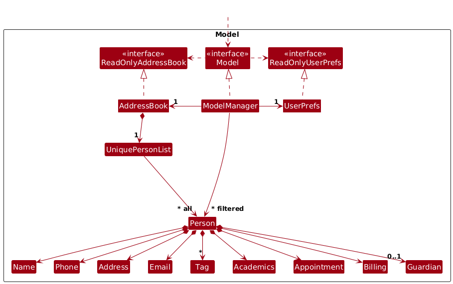
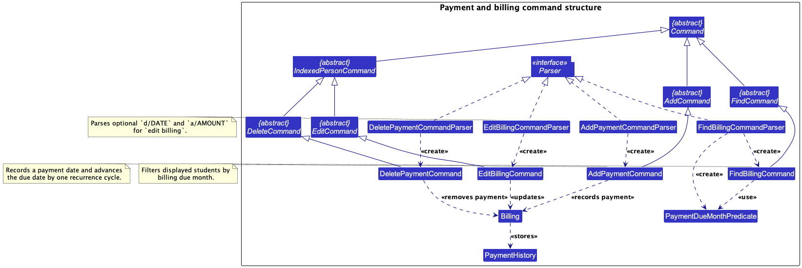
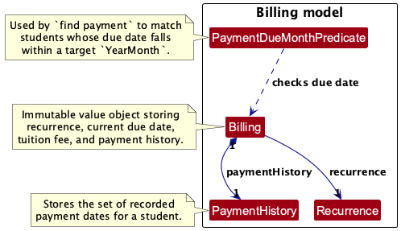

<page-nav-print />

--------------------------------------------------------------------------------------------------------------------

## **Acknowledgements**

* TutorFlow is based on [AddressBook-Level3](https://se-education.org/addressbook-level3/) by the [SE-EDU initiative](https://se-education.org).
* The GUI is built with [JavaFX](https://openjfx.io/).
* JSON persistence is implemented with [Jackson](https://github.com/FasterXML/jackson).

--------------------------------------------------------------------------------------------------------------------

## **Setting up, getting started**

Refer to the guide [_Setting up and getting started_](SettingUp.md).

--------------------------------------------------------------------------------------------------------------------

## **Design**

:bulb: **Tip:** The `.puml` files used to create diagrams are in this document `docs/diagrams` folder. Refer to the [_PlantUML Tutorial_ at se-edu/guides](https://se-education.org/guides/tutorials/plantUml.html) to learn how to create and edit diagrams.

### Architecture

The ***Architecture Diagram*** given above explains the high-level design of the App.

Given below is a quick overview of main components and how they interact with each other.

**Main components of the architecture**

**`Main`** (consisting of classes [`Main`](https://github.com/AY2526S2-CS2103T-T09-3/tp/tree/master/src/main/java/seedu/address/Main.java) and [`MainApp`](https://github.com/AY2526S2-CS2103T-T09-3/tp/tree/master/src/main/java/seedu/address/MainApp.java)) is in charge of the app launch and shut down.
* At app launch, it initializes the other components in the correct sequence, and connects them up with each other.
* At shut down, it shuts down the other components and invokes cleanup methods where necessary.

The bulk of the app's work is done by the following four components:

* [**`UI`**](#ui-component): The UI of the App.
* [**`Logic`**](#logic-component): The command executor.
* [**`Model`**](#model-component): Holds the data of the App in memory.
* [**`Storage`**](#storage-component): Reads data from, and writes data to, the hard disk.

[**`Commons`**](#common-classes) represents a collection of classes used by multiple other components.

**How the architecture components interact with each other**

For a typical mutating command such as `delete student 1`, the components interact in this order:

1. The `UI` passes the raw command text to `Logic`.
1. `Logic` parses the command and executes it against the `Model`.
1. If the command changes TutorFlow's persisted student data, `Logic` asks `Storage` to persist the updated state.
1. The `UI` observes the updated `Model` state and refreshes the displayed list and detail panels.

Each of the four main components (also shown in the diagram above),

* defines its *API* in an `interface` with the same name as the Component.
* implements its functionality using a concrete manager class that follows the corresponding component `interface`.

For example, the `Logic` component defines its API in the `Logic.java` interface and implements its functionality using the `LogicManager.java` class which follows the `Logic` interface. Other components interact with a given component through its interface rather than the concrete class (reason: to prevent outside component's being coupled to the implementation of a component), as illustrated in the (partial) class diagram below.

The sections below give more details of each component.

### UI component

The **API** of this component is specified in [`Ui.java`](https://github.com/AY2526S2-CS2103T-T09-3/tp/tree/master/src/main/java/seedu/address/ui/Ui.java)

The UI consists of a `MainWindow` that is made up of parts such as `CommandBox`, `ResultDisplay`, `PersonListPanel`, `PersonDetailPanel`, and `StatusBarFooter`. All these, including the `MainWindow`, inherit from the abstract `UiPart` class which captures the commonalities between classes that represent parts of the visible GUI.

The `UI` component uses the JavaFX UI framework. The layout of these UI parts are defined in matching `.fxml` files that are in the `src/main/resources/view` folder. For example, the layout of the [`MainWindow`](https://github.com/AY2526S2-CS2103T-T09-3/tp/tree/master/src/main/java/seedu/address/ui/MainWindow.java) is specified in [`MainWindow.fxml`](https://github.com/AY2526S2-CS2103T-T09-3/tp/tree/master/src/main/resources/view/MainWindow.fxml)

The `UI` component,

* executes user commands using the `Logic` component.
* listens for changes to `Model` data so that the UI can be updated with the modified data.
* keeps a reference to the `Logic` component, because the `UI` relies on the `Logic` to execute commands.
* depends on some classes in the `Model` component, as it displays `Person` objects residing in the `Model`.

### Logic component

**API** : [`Logic.java`](https://github.com/AY2526S2-CS2103T-T09-3/tp/tree/master/src/main/java/seedu/address/logic/Logic.java)

Here's a (partial) class diagram of the `Logic` component:

The `Logic` component receives raw command text such as `delete student 1`, parses it into a concrete `Command` object, executes that command, and returns a `CommandResult`.

How the `Logic` component works:

1. When `Logic` is called upon to execute a command, it forwards the raw input to `AddressBookParser`.
1. `AddressBookParser` identifies the top-level command word and delegates to the matching parser family such as `AddCommandParser`, `EditCommandParser`, `DeleteCommandParser`, or `FindCommandParser`.
1. For command families that support subcommands, the family parser uses `SubcommandDispatcherParser` to route the remaining input to the correct concrete parser such as `DeletePersonCommandParser` or `FindTagCommandParser`.
1. Parsing produces a concrete `Command` object which is then executed by `LogicManager`.
1. The command can communicate with the `Model` when it is executed (e.g. to delete a person). 
   Note that although this is shown as a single step in the diagram above (for simplicity), in the code it can take several interactions (between the command object and the `Model`) to achieve.
1. The result of the command execution is encapsulated as a `CommandResult` object which is returned back from `Logic`.

Here are the other classes in `Logic` (omitted from the class diagram above) that are used for parsing a user command:

How the parsing works:
* `AddressBookParser` first dispatches on the top-level command word.
* Family parsers for `add`, `edit`, `delete`, and `find` then dispatch on the first subcommand token using `SubcommandDispatcherParser`.
* All concrete parser classes implement the `Parser<T>` interface so they can be used consistently in production code and tests.

### Model component
**API** : [`Model.java`](https://github.com/AY2526S2-CS2103T-T09-3/tp/tree/master/src/main/java/seedu/address/model/Model.java)

The `Model` component,

* stores TutorFlow's core student data i.e., all `Person` objects (which are contained in a `UniquePersonList` object).
* represents student and guardian names with the `Name` value object, which requires at least one alphabetic character and
  allows only letters, numbers, spaces, apostrophes (`'`), hyphens (`-`), and periods (`.`).
* treats a student's identity as the combination of `Name` and `Email`; add, edit, and storage loading reject
  duplicate students that share both fields.
* stores the currently displayed `Person` objects as a separate _filtered_ list that is exposed as an unmodifiable `ObservableList<Person>`. The UI binds to this list so it updates automatically when the model changes.
* supports both replacing the current filter and narrowing the currently displayed list further with an additional predicate.
* preserves edited persons temporarily when a filter is active so an edited record does not disappear from the UI immediately after an edit.
* stores a `UserPrefs` object that represents the user’s preferences. This is exposed to the outside as a `ReadOnlyUserPrefs` object.
* does not depend on any of the other three components (as the `Model` represents data entities of the domain, they should make sense on their own without depending on other components)

:information_source: **Note:** An alternative (arguably, a more OOP) model is given below. It has a `Tag` list in the `AddressBook`, which `Person` references. This allows `AddressBook` to only require one `Tag` object per unique tag, instead of each `Person` needing their own `Tag` objects. 

### Storage component

**API** : [`Storage.java`](https://github.com/AY2526S2-CS2103T-T09-3/tp/tree/master/src/main/java/seedu/address/storage/Storage.java)

The `Storage` component,
* can save both student data and user preference data in JSON format, and read them back into corresponding objects.
* inherits from both `AddressBookStorage` and `UserPrefStorage`, which means it can be treated as either one (if only the functionality of only one is needed).
* depends on some classes in the `Model` component (because the `Storage` component's job is to save/retrieve objects that belong to the `Model`)

### Common classes

Classes used by multiple components are in the `seedu.address.commons` package.

--------------------------------------------------------------------------------------------------------------------

## **Implementation**

This section describes some noteworthy details on how certain features are implemented.

### Edit command

The `edit` family uses subcommand dispatch. A representative example is `edit student 1 p/98765432`.

How the `edit` command works:

1. `AddressBookParser` recognizes `edit` as the command word and forwards the remaining input to `EditCommandParser`.
1. `EditCommandParser` dispatches by subcommand name and currently supports `student`, `tag`, `acad`, `parent`, and `billing`.
1. The concrete parser parses the target index and command-specific prefixed arguments, then constructs the corresponding `Edit...Command`.
1. During execution, the command resolves the target student from the currently displayed list, builds the edited `Person`, and checks any command-specific constraints.
1. The command updates the `Model`, which replaces the target `Person` in the student registry. If a filter is active, the edited person is temporarily preserved in the displayed list.
1. `LogicManager` detects that persisted student data changed and persists the updated state through `Storage`.

### Find command

The `find` family uses subcommand dispatch similar to `edit`. A representative example is `find tag t/JC`.

How the `find` command works:

1. `AddressBookParser` recognizes `find` as the command word and forwards the remaining input to `FindCommandParser`.
1. `FindCommandParser` uses a dispatcher to route the input by subcommand name and currently supports `student`, `appt`, `tag`, `acad`, `billing`, and `parent`.
1. The concrete parser validates the input arguments and constructs the corresponding `Find...Command` with an appropriate predicate.
1. During execution, the command applies the predicate to the `Model` using `updateFilteredPersonListWithAnd(...)`, which narrows the currently displayed list further instead of resetting it to the full student list.
1. `LogicManager` checks whether the underlying persisted student data has changed. Since `find` only modifies transient model state (the filtered list), no persisted changes are detected, and the storage step is therefore skipped.

### Find appointments command

The example command for this flow is `find appt d/2026-02-13`.

How the `find appt` command works:

1. `AddressBookParser` recognizes `find` and delegates the remaining input to `FindCommandParser`.
1. `FindCommandParser` dispatches the `appt` subcommand to `FindApptCommandParser`.
1. `FindApptCommandParser` parses the optional `d/DATE` value. If omitted, it uses the current local date.
1. `FindApptCommand` constructs an `AppointmentInWeekPredicate`, which computes the Monday-Sunday week containing the target date.
1. During execution, the command applies that predicate with `updateFilteredPersonListWithAnd(...)`, so only students already in the displayed list and also matching the target week remain visible.
1. The command returns a `CommandResult` containing the number of matching appointments and the computed week range.
1. Unlike `edit`, `find appt` does not modify persisted student data, so `LogicManager` does not save any data to storage after execution.

### Subject-related commands

The subject-related feature is centered on `edit acad`, which updates a student's `Academics` object.

How the subject-related feature works:

1. `EditAcademicsCommandParser` parses the student index first, then extracts an optional `dsc/` description field and the `s/` and `l/` subject-level sequence.
1. The parser validates subject names, enforces that a level must follow a subject, rejects duplicate subject names, and supports clearing the subject list or description by passing an empty prefixed value.
1. `EditAcademicsCommand` merges the parsed updates with the student's existing `Academics` object and rebuilds the `Person`.
1. `Academics` stores a set of `Subject` objects and an optional description, while each `Subject` stores a mandatory name and an optional `Level`.

### Payment and billing commands

The payment and billing feature covers four related workflows:
`edit billing`, `add payment`, `delete payment`, and `find billing`.

The first class diagram shows the command and parser structure for these workflows.

The second class diagram shows the billing model objects used by those commands.

How the payment and billing feature works:

1. `EditBillingCommandParser` parses the student index together with optional `a/AMOUNT` and `d/DATE` fields.
1. `EditBillingCommand` updates the student's tuition fee, payment due date, or both, without touching payment history.
1. `AddPaymentCommandParser` parses `add payment INDEX d/DATE`, and `AddPaymentCommand` records that payment date. The billing due date advances by one recurrence cycle only if the added date is later than the latest recorded payment date.
1. `DeletePaymentCommandParser` parses `delete payment INDEX d/DATE`, and `DeletePaymentCommand` removes that recorded payment date. If the removed date is the latest recorded payment, the due date is rolled back by one recurrence cycle.
1. `FindBillingCommandParser` parses `find billing d/YYYY-MM` and creates a `PaymentDueMonthPredicate`.
1. `FindBillingCommand` applies that predicate to the displayed list so only students with matching billing due months remain visible.
1. `Billing` stores the recurrence schedule, current due date, tuition fee, and `PaymentHistory`, while `PaymentHistory` stores the set of recorded paid dates.

### Future work

Undo/redo and data archiving are not implemented in the current codebase.

--------------------------------------------------------------------------------------------------------------------

## **Documentation, logging, testing, configuration, dev-ops**

* [Documentation guide](Documentation.md)
* [Testing guide](Testing.md)
* [Logging guide](Logging.md)
* [Configuration guide](Configuration.md)
* [DevOps guide](DevOps.md)

--------------------------------------------------------------------------------------------------------------------

## **Appendix: Requirements**

### Product scope

**Target user profile**:
* full-time freelance private tutors managing multiple students
* prefer desktop apps over other types
* can type fast and are comfortable with CLI applications
* want to manage student contacts, appointments, and payments in one place
* need a quick way to track lessons, attendance, and tuition payments

**Value proposition**: TutorFlow allows freelance tutors to manage their students, appointments, attendance, and tuition payments quickly through a centralized CLI-based platform, reducing scheduling conflicts and helping tutors track their tutoring activities efficiently.

### User stories

Priorities: High (must have) - `* * *`, Medium (nice to have) - `* *`, Low (unlikely to have) - `*`

| Priority | As a …​ | I want to …​ | So that I can…​ |
| -------- | ------- | ------------ | ---------------- |
| `* * *` | tutor | add a new student contact to TutorFlow | track which tutees I currently teach |
| `* * *` | new user | delete a student record | remove records that I no longer need |
| `* * *` | tutor | add appointment details to a student | track lesson schedules with students |
| `* * *` | freelance tutor | view what appointments I have for the week | plan my tutoring schedule appropriately |
| `* * *` | tutor | track whether a client has paid tuition fees for the month | keep track of outstanding payments |
| `* *` | tutor | view the payment dates | know when my clients have paid for lessons |
| `* *` | tutor | add and view student attendance | evaluate lesson attendance and consistency |
| `* *` | tutor | store the name of the tutee alongside the parent’s name | easily identify the student and their guardian |
| `*` | tutor | filter students by tags or subject keywords | quickly narrow the displayed student list |
| `*` | tutor with multiple students | tag students based on subject or level | organize students for possible group tuition |                                 |

### Use cases

(For all use cases below, the **System** is `TutorFlow` and the **Actor** is the `Tutor`, unless specified otherwise)

---

**Use case: View all students**

**MSS**
1. Tutor requests to view all students.
2. TutorFlow shows all the students available in the system.

Use case ends.

**Extensions**
* 2a. There are no students available in the system
    * 2a1. TutorFlow informs the tutor that there are no students recorded.

Use case ends.

---
**Use case: View appointment details for the week**

**MSS**
1. Tutor requests to view appointments for a given week.
2. TutorFlow retrieves the appointments for the target week.
3. TutorFlow displays the list of appointments and their details.

Use case ends.

**Extensions**
* 1a. Tutor provides an invalid request.
    * 1a1. TutorFlow indicates that the request is invalid and asks for a valid date.
    * 1a2. Steps 1 to 1a2 are repeated until a valid request is provided.
* Use case resumes at step 2.

* 3a. No appointments exist for the target week.
   * 3a1. TutorFlow indicates that there are no appointments.
* Use case ends.

---
**Use case: Add appointment details for a student**

**MSS**
1. Tutor requests to view all students.
2. Tutor identifies the target student by index.
3. Tutor enters appointment details for the student.
4. TutorFlow records the appointment details and displays confirmation.

Use case ends.

**Extensions**

* 3a. The tutor enters invalid appointment details.
    * 3a1. TutorFlow shows an error message.
    * 3a2. Tutor re-enters the appointment details.
    * Steps 3a1 to 3a2 are repeated until the tutor enters valid appointment details.
* Use case resumes at step 4.

---
**Use case: Record student attendance**

**MSS**
1. Tutor requests to view all students.
2. TutorFlow shows all students.
3. Tutor selects a student.
4. Tutor records that the student has attended today’s lesson.
5. TutorFlow updates the student’s attendance and displays confirmation.

Use case ends.

**Extensions**

* 3a. Tutor records that the student has attended a previous lesson.
* Use case resumes at step 5.

* 4a. TutorFlow detects an error in the entered data.
   * 4a1. TutorFlow requests the correct data.
   * 4a2. Tutor enters new data.
* Steps 4a1 to 4a2 are repeated until the data entered is correct.
* Use case resumes at step 5.

---
**Use case: Record tuition payment for a student**

**MSS**

1. Tutor requests to list students.
2. TutorFlow shows the list of students.
3. Tutor selects a student.
4. Tutor records that the student has paid tuition for the month.
5. TutorFlow updates the student’s payment status and displays confirmation.

Use case ends.

**Extensions**

* 2a. The student list is empty.

   * 2a1. TutorFlow informs the tutor that there are no students recorded.
* Use case ends.

* 4a. The tutor enters invalid payment information.

   * 4a1. TutorFlow shows an error message.
   * 4a2. Tutor re-enters the payment information.
   * Steps 4a1 to 4a2 are repeated until the tutor enters valid payment details.
* Use case resumes at step 5.

---

**Use case: Edit parent details for a student**

**MSS**

1. Tutor requests to view all students.
2. TutorFlow shows the list of students.
3. Tutor identifies the target student by index.
4. Tutor enters the parent's or guardian's details to add or update them.
5. TutorFlow validates the provided details and updates the student record.
6. TutorFlow displays confirmation.

Use case ends.

**Extensions**

* 4a. The tutor enters invalid parent details.
    * 4a1. TutorFlow shows an error message.
    * 4a2. Tutor re-enters the parent details.
    * Steps 4a1 to 4a2 are repeated until the tutor enters valid details.
* Use case resumes at step 5.

### Non-Functional Requirements

1.  Application should work on any _mainstream OS_ as long as it has Java `17` or above installed.
2.  Should be able to hold up to 1000 student records without a noticeable sluggishness in performance for typical usage.
3.  A user with above average typing speed for regular English text (i.e. not code, not system admin commands) should be able to accomplish most of the tasks faster using commands than using the mouse.
4.  Application should respond within one second.
5.  Core features should remain usable without requiring internet access.
6.  Not required to handle communication between Tutors and Students.
7.  Not required to process real monetary transactions between Tutors and Students (e.g., payment gateway integration); only payment tracking records are in scope.

### Glossary

* **Mainstream OS**: Windows, Linux, Unix, MacOS
* **Tutor**: A freelance private tutor who uses TutorFlow to manage students, schedules, and billing
* **Student**: A person who is being taught by the tutor
* **Tuition Fee**: Amount of money that is owed or paid by a student to the tutor for the lessons
* **Appointment**: A scheduled tutoring session between a tutor and student, including date, time and subject
* **Attendance**: A record of whether a student attended a scheduled lesson
* **Tag**: A label attached to a student's contact details for grouping or filtering
* **Subject**: An academic subject stored in a student's academics profile
* **Level**: An optional level associated with a subject
* **Parent / Guardian**: Optional adult contact details linked to a student
* **CLI (Command Line Interface)**: A text-based interface where the user interacts with the application by typing commands
* **GUI (Graphical User Interface)**: A visual interface that allows interaction through graphical elements such as windows and buttons
* **API (Application Programming Interface)**: A defined set of methods and contracts through which software components communicate with each other
* **JSON**: JavaScript Object Notation, a data format used to persist data to disk
* **ObservableList**: A list data structure that notifies listeners (e.g. the UI) automatically when its contents change

--------------------------------------------------------------------------------------------------------------------

## **Appendix: Instructions for manual testing**

Given below are instructions to test the app manually.

:information_source: **Note:** These instructions only provide a starting point for testers to work on;
testers are expected to do more *exploratory* testing.

### Launch and shutdown

1. Initial launch

   1. Download the jar file and copy into an empty folder

   1. Double-click the jar file. 
      Expected: Shows the GUI with a set of sample students. The window size may not be optimum.

1. Saving window preferences

   1. Resize the window to an optimum size. Move the window to a different location. Close the window.

   1. Re-launch the app by double-clicking the jar file. 
       Expected: The most recent window size and location is retained.

1. Additional launch tests should cover starting the app from the command line and closing it after making edits.

### Deleting a student

1. Deleting a student while all students are being shown

   1. Prerequisites: List all students using the `list` command. Multiple students in the list.

   1. Test case: `delete student 1` 
      Expected: First student is deleted from the list. Details of the deleted student are shown in the status message. Timestamp in the status bar is updated.

   1. Test case: `delete student 0` 
      Expected: No student is deleted. Error details shown in the status message. Status bar remains the same.

   1. Other incorrect delete commands to try: `delete`, `delete student`, `delete student x`, `delete student 999` 
      Expected: Similar to previous.

1. Additional deletion tests should cover deleting a student from a filtered list.

### Finding appointments

1. Finding appointments for a target week

   1. Prerequisites: At least one student has an appointment within the target week.

   1. Test case: `find appt d/2026-02-13` 
      Expected: The student list is filtered to students with appointments in that Monday-Sunday week. Result message shows number of matches.

   1. Test case: `find appt` 
      Expected: Uses current local date and filters by the current week.

   1. Invalid input to try: `find appt d/13-02-2026` 
      Expected: No list changes. Error message with command format guidance is shown.

### Billing and payment updates

1. Editing billing fields

   1. Prerequisites: List all students; pick a student index with existing billing data.

   1. Test case: `edit billing 1 a/120` 
      Expected: Tuition fee is updated for student 1. Payment history remains unchanged.

   1. Test case: `edit billing 1 d/2026-04-01` 
      Expected: Billing due date is updated for student 1.

2. Recording a payment

   1. Prerequisites: Student has billing configured and at least one due date.

   1. Test case: `add payment 1 d/2026-03-20` 
      Expected: Payment date is recorded. Due date advances only if this date is later than the latest recorded payment date.

   1. Test case: Repeat `add payment 1 d/2026-03-20` 
      Expected: No data changes. Error indicates payment date already exists for that student.

3. Deleting a payment

   1. Prerequisites: Student has at least one recorded payment date.

   1. Test case: `delete payment 1 d/2026-03-20` 
      Expected: Payment date is removed. If the deleted date was the latest recorded payment date, due date rolls back by one recurrence cycle.

   1. Invalid input to try: `delete payment 1 d/2026-01-01` when date is not recorded 
      Expected: No data changes. Error indicates payment date is not recorded for that student.

### Saving data

1. Dealing with missing/corrupted data files

   1. Missing data file:
      Delete or rename `data/tutorflow.json`, then launch the app. 
      Expected: The app starts with sample data and recreates the data file on the next successful save.

   1. Corrupted data file:
      Edit `data/tutorflow.json` and replace part of the file with invalid JSON, then launch the app. 
       Expected: The app starts with an empty student list, and the log records that the data file could not be loaded.
