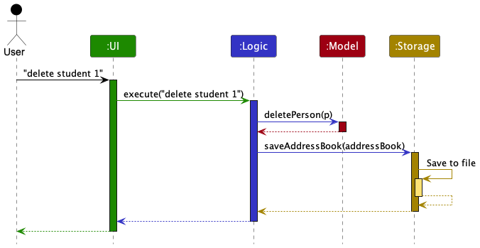
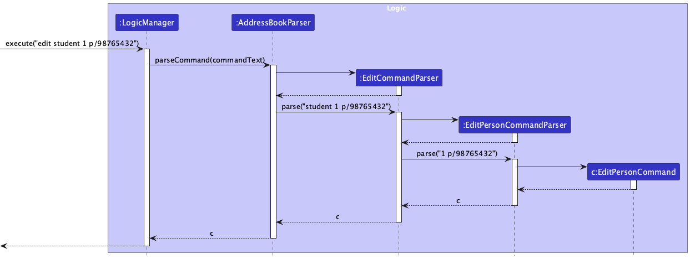
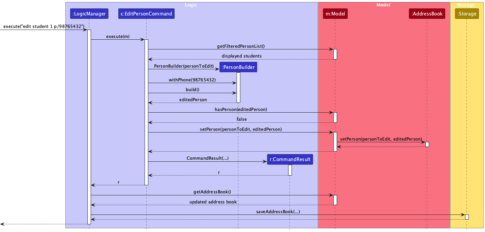
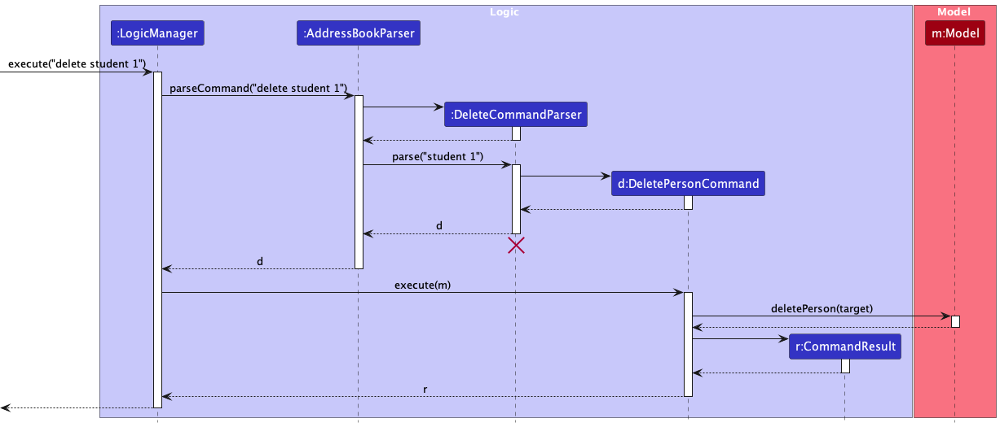
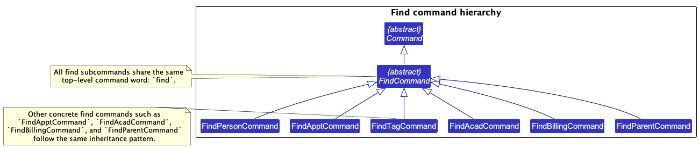
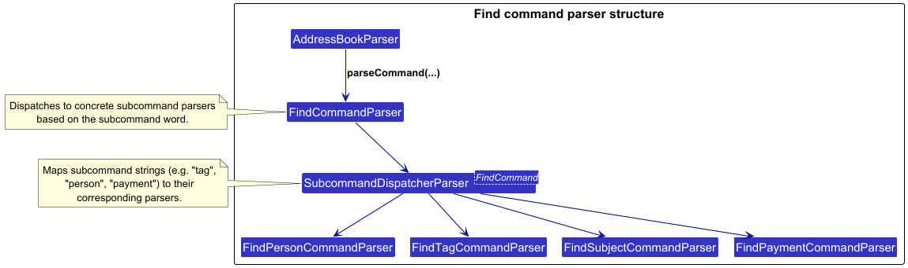
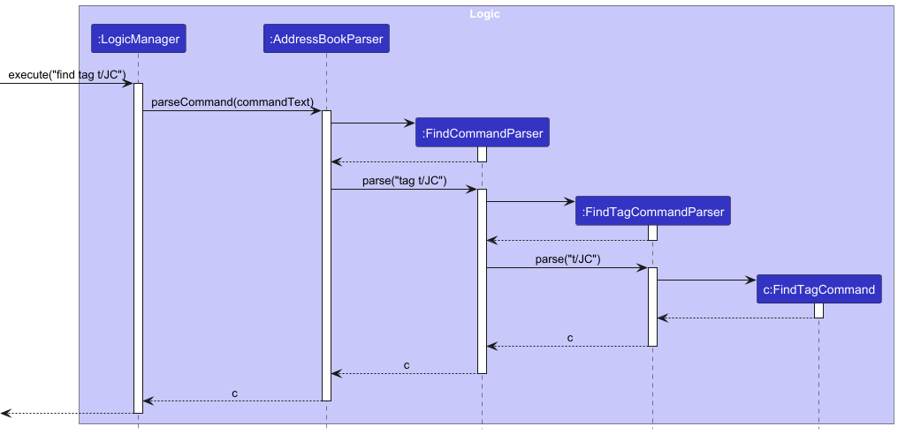
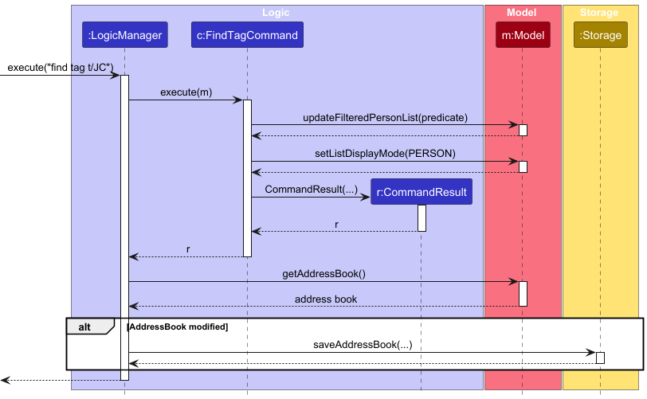
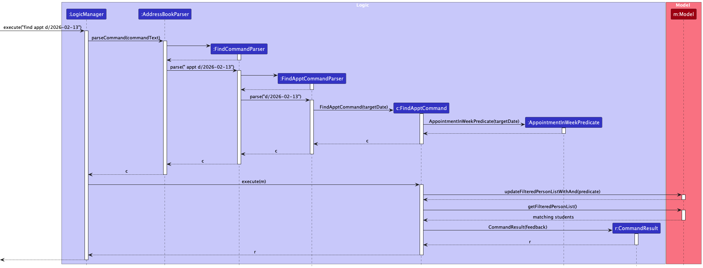
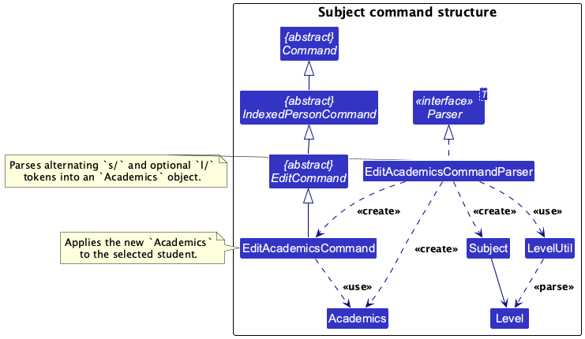

<page-nav-print />

--------------------------------------------------------------------------------------------------------------------

## **Acknowledgements**

* TutorFlow is based on [AddressBook-Level3](https://se-education.org/addressbook-level3/) by the [SE-EDU initiative](https://se-education.org).
* The GUI is built with [JavaFX](https://openjfx.io/).
* JSON persistence is implemented with [Jackson](https://github.com/FasterXML/jackson).
* AI tools (GitHub Copilot, Claude Code, Codex) were used extensively during the development process by all members.

--------------------------------------------------------------------------------------------------------------------

## **Setting up, getting started**

Refer to the guide [_Setting up and getting started_](SettingUp.md).

--------------------------------------------------------------------------------------------------------------------

## **Design**

<box type="tip" seamless header="**Tip**">
<md>
The `.puml` files used to create diagrams are in this document `docs/diagrams` folder. Refer to the [_PlantUML Tutorial_ at se-edu/guides](https://se-education.org/guides/tutorials/plantUml.html) to learn how to create and edit diagrams.
</md>
</box>

### Diagram conventions used in this guide

The diagrams in this guide follow UML notation used in the course:

* solid line with hollow triangle: inheritance
* solid line with simple arrow: navigable association (one-way dependency)
* dashed line with hollow triangle: interface realization
* dashed line with simple arrow: usage dependency

To keep diagrams readable:

* architecture diagrams show components and dependencies only (not parser-level classes)
* class diagrams show only classes relevant to the discussion
* sequence diagrams are used for command flows where ordering of interactions matters

### Architecture

<puml src="diagrams/ArchitectureDiagram.puml" width="280" />

The ***Architecture Diagram*** above shows the high-level design of the app.

The next diagram focuses on runtime collaboration between components for a typical mutating command.

Given below is a high-level overview of the main components and their responsibilities.

**Main components of the architecture**

**`Main`** (consisting of classes [`Main`](https://github.com/AY2526S2-CS2103T-T09-3/tp/tree/master/src/main/java/seedu/address/Main.java) and [`MainApp`](https://github.com/AY2526S2-CS2103T-T09-3/tp/tree/master/src/main/java/seedu/address/MainApp.java)) is in charge of app startup and shutdown.
* At app launch, it initializes the other components in the correct sequence, and connects them up with each other.
* At shut down, it shuts down the other components and invokes cleanup methods where necessary.

The bulk of the app's work is done by the following four components:

* [**`UI`**](#ui-component): The UI of the App.
* [**`Logic`**](#logic-component): The command executor.
* [**`Model`**](#model-component): Holds the data of the App in memory.
* [**`Storage`**](#storage-component): Reads data from, and writes data to, the hard disk.

[**`Commons`**](#common-classes) represents a collection of classes used by multiple other components.

**How the architecture components interact**

For a typical mutating command such as `delete student 1`, the components interact in this order:

1. The `UI` passes the raw command text to `Logic`.
1. `Logic` parses the command and executes it against the `Model`.
1. If the command changes TutorFlow's persisted student data, `Logic` asks `Storage` to persist the updated state.
1. The `UI` observes the updated `Model` state and refreshes the displayed list and detail panels.

Each of the four main components (also shown in the diagram above),

* defines its API in an `interface` with the same name as the component.
* implements its functionality using a concrete manager class that follows that `interface`.

For example, the `Logic` component defines its API in `Logic.java` and implements it in `LogicManager.java`. Other components interact with `Logic` through that interface to reduce coupling.

<puml src="diagrams/ComponentManagers.puml" width="300" />

The sections below give more details of each component.

### UI component

The **API** of this component is specified in [`Ui.java`](https://github.com/AY2526S2-CS2103T-T09-3/tp/tree/master/src/main/java/seedu/address/ui/Ui.java)

<puml src="diagrams/UiClassDiagram.puml" alt="Structure of the UI Component"/>

The UI consists of a `MainWindow` that is made up of parts such as `CommandBox`, `ResultDisplay`, `PersonListPanel`, `PersonDetailPanel`, and `StatusBarFooter`. All these, including the `MainWindow`, inherit from the abstract `UiPart` class which captures the commonalities between classes that represent parts of the visible GUI.

The `UI` component uses the JavaFX UI framework. The layout of these UI parts are defined in matching `.fxml` files that are in the `src/main/resources/view` folder. For example, the layout of the [`MainWindow`](https://github.com/AY2526S2-CS2103T-T09-3/tp/tree/master/src/main/java/seedu/address/ui/MainWindow.java) is specified in [`MainWindow.fxml`](https://github.com/AY2526S2-CS2103T-T09-3/tp/tree/master/src/main/resources/view/MainWindow.fxml)

The `UI` component,

* executes user commands using the `Logic` component.
* listens for changes to `Model` data so that the UI can be updated with the modified data.
* keeps a reference to the `Logic` component, because the `UI` relies on the `Logic` to execute commands.
* depends on some classes in the `Model` component, as it displays `Person` objects residing in the `Model`.

### Logic component

**API** : [`Logic.java`](https://github.com/AY2526S2-CS2103T-T09-3/tp/tree/master/src/main/java/seedu/address/logic/Logic.java)

Here's a (partial) class diagram of the `Logic` component:

<puml src="diagrams/LogicClassDiagram.puml" width="550"/>

The `Logic` component receives raw command text such as `delete student 1`, parses it into a concrete `Command` object, executes that command, and returns a `CommandResult`.

How the `Logic` component works at a high level:

1. `LogicManager` forwards the raw user input to the parser layer.
1. The parser layer identifies the command family and subcommand, then builds a concrete `Command` object.
1. `LogicManager` executes that `Command` against the `Model`.
1. If the command mutates persistent data, `LogicManager` triggers a save through `Storage`.
1. `Logic` returns a `CommandResult` to the `UI`.

Here are the other classes in `Logic` (omitted from the class diagram above) that are used for parsing a user command:

<puml src="diagrams/ParserClasses.puml" width="600"/>

How the parsing works:
* `AddressBookParser` first dispatches on the top-level command word.
* Family parsers for `add`, `edit`, `delete`, and `find` then dispatch on the first subcommand token.
* All concrete parser classes implement the `Parser<T>` interface so they can be used consistently in production code and tests.
* Detailed parser flow for specific features is documented in the [Implementation](#implementation) section.

### Model component
**API** : [`Model.java`](https://github.com/AY2526S2-CS2103T-T09-3/tp/tree/master/src/main/java/seedu/address/model/Model.java)

<puml src="diagrams/ModelClassDiagram.puml" width="450" />

The `Model` component,

* stores TutorFlow's core student data i.e., all `Person` objects (which are contained in a `UniquePersonList` object).
* represents student and guardian names with the `Name` value object, which requires at least one alphabetic character and
  allows only letters, numbers, spaces, apostrophes (`'`), hyphens (`-`), and periods (`.`).
* treats a student's identity as the combination of `Name` and `Email`; add, edit, and storage loading reject
  duplicate students that share both fields.
* stores the currently displayed `Person` objects as a separate _filtered_ list that is exposed as an unmodifiable `ObservableList<Person>`. The UI binds to this list so it updates automatically when the model changes.
* supports both replacing the current filter and narrowing the currently displayed list further with an additional predicate.
* preserves edited persons temporarily when a filter is active so an edited record does not disappear from the UI immediately after an edit.
* stores a `UserPrefs` object that represents the user’s preferences. This is exposed to the outside as a `ReadOnlyUserPrefs` object.
* does not depend on any of the other three components (as the `Model` represents data entities of the domain, they should make sense on their own without depending on other components)

<box type="info" seamless header="**Note**">
<md>
An alternative (arguably, a more OOP) model is given below. It has a `Tag` list in the `AddressBook`, which `Person` references. This allows `AddressBook` to only require one `Tag` object per unique tag, instead of each `Person` needing their own `Tag` objects. 
</md>

<puml src="diagrams/BetterModelClassDiagram.puml" width="450" />

</box>

### Storage component

**API** : [`Storage.java`](https://github.com/AY2526S2-CS2103T-T09-3/tp/tree/master/src/main/java/seedu/address/storage/Storage.java)

<puml src="diagrams/StorageClassDiagram.puml" width="550" />

The `Storage` component,
* can save both student data and user preference data in JSON format, and read them back into corresponding objects.
* inherits from both `AddressBookStorage` and `UserPrefStorage`, which means it can be treated as either one (if only the functionality of only one is needed).
* depends on some classes in the `Model` component (because the `Storage` component's job is to save/retrieve objects that belong to the `Model`)

### Common classes

Classes used by multiple components are in the `seedu.address.commons` package.

--------------------------------------------------------------------------------------------------------------------

## **Implementation**

This section describes some noteworthy details on how certain features are implemented.

### Edit command

The `edit` family uses subcommand dispatch. A representative example is `edit student 1 p/98765432`.

The flow is shown in these UML sequence diagrams:

How the `edit` command works:

1. `AddressBookParser` recognizes `edit` as the command word and forwards the remaining input to `EditCommandParser`.
1. `EditCommandParser` dispatches by subcommand name and currently supports `student`, `tag`, `acad`, `parent`, `billing`, and `appt`.
1. The concrete parser parses the target index and command-specific prefixed arguments, then constructs the corresponding `Edit...Command`.
1. During execution, the command resolves the target student from the currently displayed list, builds the edited `Person`, and checks any command-specific constraints.
1. The command updates the `Model`, which replaces the target `Person` in the student registry. If a filter is active, the edited person is temporarily preserved in the displayed list.
1. `LogicManager` detects that persisted student data changed and persists the updated state through `Storage`.

### Delete command

The `delete` family uses subcommand dispatch. A representative example is `delete student 1`.

The sequence diagram below shows the high-level execution flow.

How the `delete` command works:

1. `AddressBookParser` recognizes `delete` as the command word and forwards the remaining input to `DeleteCommandParser`.
1. `DeleteCommandParser` dispatches by subcommand name and currently supports `student`, `tag`, `acad`, `payment`, `appt`, and `attd`.
1. The concrete parser parses the target index and command-specific arguments, then constructs the corresponding `Delete...Command`.
1. During execution, the command resolves the target student from the currently displayed list and checks any command-specific constraints.
1. The command updates the `Model`, which removes the target data from the student registry.
1. `LogicManager` detects that persisted student data changed and persists the updated state through `Storage`.

### Find command

The `find` family uses subcommand dispatch similar to `edit`. A representative example is `find tag t/JC`.

The command and parser hierarchies are shown below.

For `find tag`, the parsing and execution interactions are shown in these UML sequence diagrams.

How the `find` command works:

1. `AddressBookParser` recognizes `find` as the command word and forwards the remaining input to `FindCommandParser`.
1. `FindCommandParser` uses a dispatcher to route the input by subcommand name and currently supports `student`, `appt`, `tag`, `acad`, `billing`, and `parent`.
1. The concrete parser validates the input arguments and constructs the corresponding `Find...Command` with an appropriate predicate.
1. During execution, the command applies the predicate to the `Model` using `updateFilteredPersonListWithAnd(...)`, which narrows the currently displayed list further instead of resetting it to the full student list.
1. `LogicManager` checks whether the underlying persisted student data has changed. Since `find` only modifies transient model state (the filtered list), no persisted changes are detected, and the storage step is therefore skipped.

### Find tag command

The `find tag` flow is a good example of a command family that uses both parser and execution diagrams.

The command hierarchy and flow are shown below.

The sequence diagrams below show parsing and execution for `find tag`.

How the `find tag` command works:

1. `AddressBookParser` recognizes `find` as the command word and forwards the remaining input to `FindCommandParser`.
1. `FindCommandParser` dispatches the `tag` subcommand to `FindTagCommandParser`.
1. The parser validates the tag argument and constructs a `FindTagCommand` with the matching predicate.
1. During execution, the command applies that predicate to the `Model` using `updateFilteredPersonListWithAnd(...)`.
1. The command returns a `CommandResult` summarizing the filtered result.
1. Because only the filtered list changes, `LogicManager` does not persist any data.

### Find appointments command

The example command for this flow is `find appt d/2026-02-13`.

The flow is shown in the UML sequence diagram below.

How the `find appt` command works:

1. `AddressBookParser` recognizes `find` and delegates the remaining input to `FindCommandParser`.
1. `FindCommandParser` dispatches the `appt` subcommand to `FindApptCommandParser`.
1. `FindApptCommandParser` parses the optional `d/DATE` value. If omitted, it uses the current Singapore date.
1. `FindApptCommand` constructs an `AppointmentInWeekPredicate`, which computes the Monday-Sunday week containing the target date.
1. During execution, the command applies that predicate with `updateFilteredPersonListWithAnd(...)`, so only students already in the displayed list and also matching the target week remain visible.
1. The command returns a `CommandResult` containing the number of matching appointments and the computed week range.
1. Unlike `edit`, `find appt` does not modify persisted student data, so `LogicManager` does not save any data to storage after execution.

### Subject-related commands

The subject-related feature is centered on `edit acad`, which updates a student's `Academics` object.

The command relationships for the subject feature are shown in the UML class diagram below.

How the subject-related feature works:

1. `EditAcademicsCommandParser` parses the student index first, then extracts an optional `dsc/` description field and the `s/` and `l/` subject-level sequence.
1. The parser validates subject names, enforces that a level must follow a subject, rejects duplicate subject names, and supports clearing the subject list or description by passing an empty prefixed value.
1. `EditAcademicsCommand` merges the parsed updates with the student's existing `Academics` object and rebuilds the `Person`.
1. `Academics` stores a set of `Subject` objects and an optional description, while each `Subject` stores a mandatory name and an optional `Level`.

### Payment and billing commands

The payment and billing feature covers four related workflows:
`edit billing`, `add payment`, `delete payment`, and `find billing`.

The first class diagram shows the command and parser structure for these workflows.

<puml src="diagrams/PaymentBillingCommandClassDiagram.puml" width="720" />

The second class diagram shows the billing model objects used by those commands.

<puml src="diagrams/BillingModelClassDiagram.puml" width="620" />

How the payment and billing feature works:

1. `EditBillingCommandParser` parses the student index together with optional `a/AMOUNT` and `d/DATE` fields.
1. `EditBillingCommand` updates the student's tuition fee, payment due date, or both, without touching payment history.
1. `AddPaymentCommandParser` parses `add payment INDEX d/DATE`, and `AddPaymentCommand` records that payment date. The billing due date advances by one recurrence cycle only if the added date is later than the latest recorded payment date.
1. `DeletePaymentCommandParser` parses `delete payment INDEX d/DATE`, and `DeletePaymentCommand` removes that recorded payment date. If the removed date is the latest recorded payment, the due date is rolled back by one recurrence cycle.
1. `FindBillingCommandParser` parses `find billing d/YYYY-MM` and creates a `PaymentDueMonthPredicate`.
1. `FindBillingCommand` applies that predicate to the displayed list so only students with matching billing due months remain visible.
1. `Billing` stores the recurrence schedule, current due date, tuition fee, and `PaymentHistory`, while `PaymentHistory` stores the set of recorded paid dates.

### Appointment and attendance commands

The appointment and attendance feature covers:
`add appt`, `edit appt`, `delete appt`, `add attd`, and `delete attd`.

How the appointment and attendance feature works:

1. Appointment commands (`add appt`, `edit appt`, `delete appt`) update a student's scheduled sessions.
1. Attendance commands (`add attd`, `delete attd`) target one appointment session and then update its `AttendanceHistory`.
1. For recurring sessions, attendance updates can affect the computed next session date when the latest record changes.
1. Commands validate date/date-time formats and prevent invalid state transitions (for example, duplicate attendance records for the same recurring session date).
1. All successful updates replace the target `Person` in the model and persist through `Storage`.

`find appt` sequence behavior is already shown in the [Find appointments command](#find-appointments-command) section above.

### Future work

Undo/redo and data archiving are not implemented in the current codebase.

--------------------------------------------------------------------------------------------------------------------

## **Documentation, logging, testing, configuration, dev-ops**

* [Documentation guide](Documentation.md)
* [Testing guide](Testing.md)
* [Logging guide](Logging.md)
* [Configuration guide](Configuration.md)
* [DevOps guide](DevOps.md)

--------------------------------------------------------------------------------------------------------------------

## **Appendix: Requirements**

### Product scope

**Target user profile**:
* full-time freelance private tutors managing multiple students
* prefer desktop apps over other types
* can type fast and are comfortable with CLI applications
* want to manage student contacts, appointments, and payments in one place
* need a quick way to track lessons, attendance, and tuition payments

**Value proposition**: TutorFlow allows freelance tutors to manage their students, appointments, attendance, and tuition payments quickly through a centralized CLI-based platform, reducing scheduling conflicts and helping tutors track their tutoring activities efficiently.

### User stories

Priorities: High (must have) - `* * *`, Medium (nice to have) - `* *`, Low (unlikely to have) - `*`

| Priority | As a …​ | I want to …​ | So that I can…​ |
| -------- | ------- | ------------ | ---------------- |
| `* * *` | tutor | add a new student record | keep track of all students I teach |
| `* * *` | tutor | edit student contact and profile details | keep each student's information up to date |
| `* * *` | tutor | delete a student record | remove students I no longer teach |
| `* * *` | tutor | schedule, edit, and remove appointments | maintain an accurate lesson schedule |
| `* * *` | tutor | find appointments for a target week | plan my teaching week quickly |
| `* * *` | tutor | record tuition payments and due dates | track outstanding payments |
| `* *` | tutor | record attendance for a lesson | monitor student consistency |
| `* *` | tutor | search by tag, subject, or parent details | narrow the list to relevant students |
| `* *` | tutor | update parent or guardian information | contact the correct adult quickly |
| `*` | tutor with many students | tag students by subject or level | organize students for lesson planning |

### Use cases

(For all use cases below, the **System** is `TutorFlow` and the **Actor** is the `Tutor`, unless specified otherwise)

---

**Use case: List all students**

**MSS**
1. Tutor requests to view all students.
2. TutorFlow displays all students.

Use case ends.

**Extensions**
* 2a. There are no student records.
   * 2a1. TutorFlow displays an empty list.

Use case ends.

---
**Use case: View appointment details for the week**

**MSS**
1. Tutor requests to view appointments for a given week.
2. TutorFlow filters students with appointments in that week.
3. TutorFlow displays matching students.

Use case ends.

**Extensions**
* 1a. Tutor provides an invalid date format.
   * 1a1. TutorFlow displays an error message with the expected format.
   * 1a2. Tutor enters a corrected command.
   * Use case resumes at step 1.

* 3a. No appointments exist for the target week.
   * 3a1. TutorFlow displays zero matches.

---
**Use case: Add an appointment for a student**

**MSS**
1. Tutor requests to view all students.
2. Tutor identifies the target student by index.
3. Tutor enters appointment details for the student.
4. TutorFlow validates and records the appointment.
5. TutorFlow displays confirmation.

Use case ends.

**Extensions**

* 3a. The tutor enters invalid appointment details.
   * 3a1. TutorFlow displays an error message.
   * 3a2. Tutor enters corrected details.
   * Use case resumes at step 3.

---
**Use case: Record attendance for an appointment**

**MSS**
1. Tutor requests to view all students.
2. TutorFlow shows all students.
3. Tutor selects a student.
4. Tutor specifies an appointment and records attendance.
5. TutorFlow updates the student’s attendance and displays confirmation.

Use case ends.

**Extensions**

* 4a. Tutor enters an invalid attendance date/date-time.
   * 4a1. TutorFlow displays an error message.
   * 4a2. Tutor enters corrected data.
   * Use case resumes at step 4.

* 4b. Attendance for that target is already recorded.
   * 4b1. TutorFlow rejects the duplicate attendance update.
   * Use case ends.

---
**Use case: Record tuition payment for a student**

**MSS**

1. Tutor requests to list students.
2. TutorFlow shows the list of students.
3. Tutor selects a student.
4. Tutor records a payment date for the student.
5. TutorFlow updates the student’s payment status and displays confirmation.

Use case ends.

**Extensions**

* 2a. The student list is empty.
   * 2a1. TutorFlow displays an empty list.
   * Use case ends.

* 4a. The tutor enters invalid payment information.
   * 4a1. TutorFlow displays an error message.
   * 4a2. Tutor enters corrected payment information.
   * Use case resumes at step 4.

* 4b. The payment date already exists in the student's payment history.
   * 4b1. TutorFlow rejects the duplicate payment date.
   * Use case ends.

---

**Use case: Edit parent details for a student**

**MSS**

1. Tutor requests to view all students.
2. TutorFlow shows the list of students.
3. Tutor identifies the target student by index.
4. Tutor enters the parent's or guardian's details to add or update them.
5. TutorFlow validates the provided details and updates the student record.
6. TutorFlow displays confirmation.

Use case ends.

**Extensions**

* 4a. The tutor enters invalid parent details.
   * 4a1. TutorFlow shows an error message.
   * 4a2. Tutor re-enters the parent details.
   * Use case resumes at step 4.

---

**Use case: Edit billing details for a student**

**MSS**
1. Tutor requests to list students.
2. TutorFlow shows the list of students.
3. Tutor identifies the target student by index.
4. Tutor enters updated billing details.
5. TutorFlow validates and updates the billing data.
6. TutorFlow displays confirmation.

Use case ends.

**Extensions**

* 3a. The target index is invalid.
   * 3a1. TutorFlow displays an error message.
   * 3a2. Tutor enters a valid index.
   * Use case resumes at step 3.

* 4a. The tutor provides invalid billing amount or due date.
   * 4a1. TutorFlow displays an error message.
   * 4a2. Tutor enters corrected billing details.
   * Use case resumes at step 4.

---

**Use case: Find students by billing due month**

**MSS**
1. Tutor requests to find students by billing month.
2. TutorFlow validates the target month.
3. TutorFlow filters students whose billing due date falls in that month.
4. TutorFlow displays the filtered list.

Use case ends.

**Extensions**

* 1a. The tutor provides an invalid month format.
   * 1a1. TutorFlow displays an error message with the expected format.
   * 1a2. Tutor enters a corrected command.
   * Use case resumes at step 1.

* 4a. No students match the target month.
   * 4a1. TutorFlow displays zero matches.

---

**Use case: Delete attendance for an appointment**

**MSS**
1. Tutor requests to view all students.
2. TutorFlow shows all students.
3. Tutor identifies the target student and appointment.
4. Tutor specifies the attendance record to remove.
5. TutorFlow validates and removes the attendance record.
6. TutorFlow displays confirmation.

Use case ends.

**Extensions**

* 4a. The tutor provides an invalid attendance date/date-time.
   * 4a1. TutorFlow displays an error message.
   * 4a2. Tutor enters corrected data.
   * Use case resumes at step 4.

* 5a. No attendance record exists for the specified target.
   * 5a1. TutorFlow displays an error message.
   * Use case ends.

### Non-Functional Requirements

1.  The application should work on any _mainstream OS_ with Java `17` or above.
2.  With up to 1000 student records, typical commands should complete within 1 second on a laptop with at least 8 GB RAM.
3.  On first use, a tutor should be able to perform add, find, edit, and delete operations after at most 15 minutes of reading the User Guide.
4.  The application should not require an internet connection for core features (student, appointment, attendance, and billing management).
5.  Data should be persisted automatically after each successful mutating command so progress is not lost on normal app shutdown.
6.  The application should provide clear and actionable validation messages for invalid command formats.
7.  Not required to handle communication between Tutors and Students.
8.  Not required to process real monetary transactions between Tutors and Students (e.g., payment gateway integration); only payment tracking records are in scope.

### Glossary

* **Mainstream OS**: Windows, macOS, and Linux.
* **Tutor**: A freelance private tutor who uses TutorFlow to manage students, schedules, and billing.
* **Student**: A person taught by the tutor.
* **Appointment**: A scheduled lesson entry associated with a student.
* **Attendance**: A recorded present/absent outcome for a specific appointment date or date-time.
* **Tuition fee**: The amount charged for lessons according to a student's billing setup.
* **Billing due date**: The next date on which payment is expected.
* **Payment history**: The set of dates on which payments have been recorded.
* **Subject**: An academic subject in a student's academics profile.
* **Level**: An optional academic level associated with a subject.
* **Parent / Guardian**: Optional adult contact details linked to a student.
* **CLI (Command Line Interface)**: A text-based interface where the user interacts with the application by typing commands
* **GUI (Graphical User Interface)**: A visual interface that allows interaction through graphical elements such as windows and buttons
* **API (Application Programming Interface)**: A defined set of methods and contracts through which software components communicate with each other
* **JSON**: JavaScript Object Notation, a data format used to persist data to disk
* **ObservableList**: A list data structure that notifies listeners (e.g. the UI) automatically when its contents change
--------------------------------------------------------------------------------------------------------------------

## **Appendix: Instructions for manual testing**

Given below are instructions to test the app manually.

<box type="info" seamless header="**Note**">
<md>
These instructions only provide a starting point for testers to work on;
testers are expected to do more *exploratory* testing.

</md>

</box>

### Launch and shutdown

1. Initial launch

   1. Download the jar file and copy into an empty folder

   1. Double-click the jar file. 
      Expected: Shows the GUI with a set of sample students. The window size may not be optimum.

1. Saving window preferences

   1. Resize the window to an optimum size. Move the window to a different location. Close the window.

   1. Re-launch the app by double-clicking the jar file. 
       Expected: The most recent window size and location is retained.

1. Additional launch tests should cover starting the app from the command line and closing it after making edits.

### Deleting a student

1. Deleting a student while all students are being shown

   1. Prerequisites: List all students using the `list` command. Multiple students in the list.

   1. Test case: `delete student 1` 
      Expected: First student is deleted from the list. Details of the deleted student are shown in the status message. Timestamp in the status bar is updated.

   1. Test case: `delete student 0` 
      Expected: No student is deleted. Error details shown in the status message. Status bar remains the same.

   1. Other incorrect delete commands to try: `delete`, `delete student`, `delete student x`, `delete student 999` 
      Expected: Similar to previous.

1. Additional deletion tests should cover deleting a student from a filtered list.

### Finding appointments

1. Finding appointments for a target week

   1. Prerequisites: At least one student has an appointment within the target week.

   1. Test case: `find appt d/2026-02-13` 
      Expected: The student list is filtered to students with appointments in that Monday-Sunday week. Result message shows number of matches.

   1. Test case: `find appt` 
      Expected: Uses the current Singapore date and filters by the current week.

   1. Invalid input to try: `find appt d/13-02-2026` 
      Expected: No list changes. Error message with command format guidance is shown.

### Tag and academic updates

1. Editing tags for a student

   1. Prerequisites: List all students and choose a valid student index.

   1. Test case: `edit tag 1 t/Upper Sec t/Math` 
      Expected: Student 1's tags are replaced with `Upper Sec` and `Math`.

   1. Test case: `edit tag 1 t/` 
      Expected: All tags for student 1 are cleared.

2. Adding and removing subjects

   1. Prerequisites: List all students and choose a valid student index.

   1. Test case: `add acad 1 s/Math l/Strong s/Science` 
      Expected: Student 1 gains or updates the listed subjects. Existing unrelated subjects remain unchanged.

   1. Test case: `edit acad 1 dsc/Needs more timed practice` 
      Expected: The academic description is updated without changing the subject list.

   1. Invalid input to try: `add acad 1 s/Math l/Strong s/Math` 
      Expected: No data changes. Error indicates duplicate subjects in one command are not allowed.

### Parent details

1. Editing parent / guardian details

   1. Prerequisites: List all students and choose a valid student index.

   1. Test case: `edit parent 1 n/Jane Tan p/91234567 e/janetan@example.com` 
      Expected: Student 1's parent / guardian details are created or updated.

   1. Invalid input to try: `edit parent 1 p/abcd` 
      Expected: No data changes. Error message indicates phone format is invalid.

### Appointment and attendance updates

1. Adding and editing appointments

   1. Prerequisites: List all students and choose a valid student index.

   1. Test case: `add appt 1 d/2026-04-16T15:00:00 r/WEEKLY dsc/Math revision` 
      Expected: A recurring appointment is added for student 1.

   1. Test case: `edit appt 1 s/1 d/2026-04-17T15:00:00 dsc/Math revision at library` 
      Expected: Session 1 for student 1 is updated with the new date-time and description.

   1. Invalid input to try: `add appt 1 d/2026/04/16 15:00 dsc/Math revision` 
      Expected: No data changes. Error message indicates the required ISO date-time format.

2. Deleting appointments

   1. Prerequisites: Student 1 has at least one appointment visible in the detail panel after `view 1`.

   1. Test case: `delete appt 1 s/1` 
      Expected: The specified session is removed from student 1.

3. Recording and deleting attendance

   1. Prerequisites: Student 1 has at least one appointment visible in the detail panel after `view 1`.

   1. Test case: `add attd 1 s/1 y d/2026-04-10` 
      Expected: A present attendance record is added for the selected session.

   1. Test case: `delete attd 1 s/1 d/2026-04-10` 
      Expected: Attendance records on that date for the selected session are removed.

   1. Invalid input to try: `add attd 1 s/1 maybe` 
      Expected: No data changes. Error message indicates only `y` or `n` is accepted as status.

### Billing and payment updates

1. Editing billing fields

   1. Prerequisites: List all students; pick a student index with existing billing data.

   1. Test case: `edit billing 1 a/120` 
      Expected: Tuition fee is updated for student 1. Payment history remains unchanged.

   1. Test case: `edit billing 1 d/2026-04-01` 
      Expected: Billing due date is updated for student 1.

2. Recording a payment

   1. Prerequisites: Student has billing configured and at least one due date.

   1. Test case: `add payment 1 d/2026-03-20` 
      Expected: Payment date is recorded. Due date advances only if this date is later than the latest recorded payment date.

   1. Test case: Repeat `add payment 1 d/2026-03-20` 
      Expected: No data changes. Error indicates payment date already exists for that student.

3. Deleting a payment

   1. Prerequisites: Student has at least one recorded payment date.

   1. Test case: `delete payment 1 d/2026-03-20` 
      Expected: Payment date is removed. If the deleted date was the latest recorded payment date, due date rolls back by one recurrence cycle.

   1. Invalid input to try: `delete payment 1 d/2026-01-01` when date is not recorded 
      Expected: No data changes. Error indicates payment date is not recorded for that student.

### Saving data

1. Dealing with missing/corrupted data files

   1. Missing data file:
      Delete or rename `data/tutorflow.json`, then launch the app. 
      Expected: The app starts with sample data and recreates the data file on the next successful save.

   1. Corrupted data file:
      Edit `data/tutorflow.json` and replace part of the file with invalid JSON, then launch the app. 
       Expected: The app starts with an empty student list, and the log records that the data file could not be loaded.

## **Planned Enhancements**

Team size: 5

1. Make `dsc/` handling stricter in appointment commands

   The current `add appt` and `edit appt` parsing flow may mis-handle malformed prefix sequences, which can cause `dsc/` content to be ignored or interpreted unexpectedly.
   We plan to tighten parser validation so invalid prefix order and malformed trailing text are rejected with clear, cause-specific errors instead of being silently misinterpreted.

2. Make `dsc/` handling stricter in academic commands

   The current `edit acad` parser may allow malformed subject-level sequences to interfere with how the `dsc/` field is interpreted.
   We plan to validate the boundary between repeated `s/` `l/` pairs and the single `dsc/` field more strictly so invalid combinations fail clearly while valid descriptions are always preserved.

3. Reject overlapping appointments for the same student

   TutorFlow currently allows a student to have appointments with overlapping time slots, which can produce unrealistic schedules.
   We plan to detect overlaps during `add appt` and `edit appt`, and reject conflicting updates with an error that identifies the existing overlapping session.

4. Make invalid-index error messages more specific

   Some commands currently report index-related failures in a generic way, which slows user recovery.
   We plan to update these messages so they specify whether the invalid value is a student index or a sub-item index, and remind users whether the value should come from the student list or the selected student's detail panel.

5. Use of `BigDecimal` for amount in `Billing` and `Payment` models for accuracy

   The current billing flow stores monetary values as `double` (for example, tuition fee in `Billing`), which can introduce binary floating-point precision artifacts such as `0.1` not being represented exactly.
   We plan to migrate amount storage and operations to `BigDecimal`, define a consistent scale and rounding policy for money values, and update parser, formatting, and storage adapter logic accordingly.

6. Add validation to prevent parent names from matching student names

   The current parent/guardian update flow does not check whether a parent name matches any student (tutee) name in the address book, which can lead to avoidable data-entry confusion.
   We plan to add a warning check in parent-related commands so users are alerted when such a name match is detected; this warning will not block the update but will highlight the issue in the command result display.
