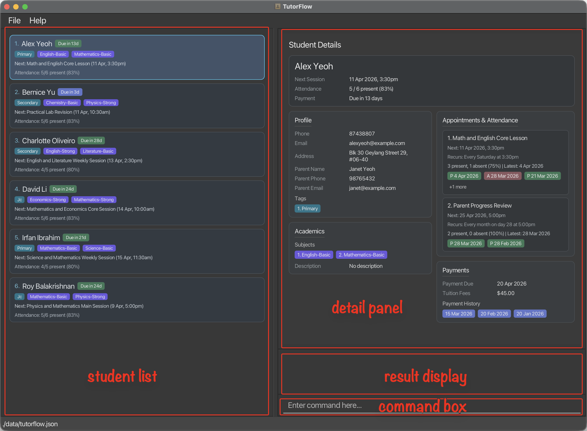
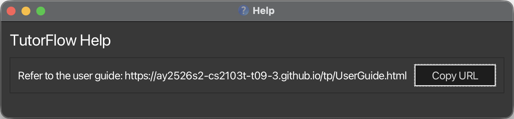

  

TutorFlow is a **desktop app for freelance private tutors who need to manage students, parents, billing, and lesson schedules in one place**. It is optimized for keyboard-first use, so tutors who are comfortable typing commands can update records faster than with a mouse-only workflow.

TutorFlow keeps your student list, parent / guardian details, academics, tuition billing, payment history, appointments, and attendance records together in a single interface.

--------------------------------------------------------------------------------------------------------------------

## Quick start

1. Ensure that Java `17` or above is installed on your computer.
   **Mac users:** follow the setup notes [here](https://se-education.org/guides/tutorials/javaInstallationMac.html).

1. Download the latest `tutorflow.jar` from the [releases page](https://github.com/AY2526S2-CS2103T-T09-3/tp/releases).

1. Move the jar file into the folder you want TutorFlow to use as its home folder.

1. Open a terminal, `cd` into that folder, for example, `cd target_directory/tutorflow_app`, and run:

   `java -jar tutorflow.jar`

1. On first launch, or when no existing data file is present, TutorFlow starts with sample data so that you can try the commands immediately.

1. Type a command into the command box and press Enter to run it. Try these first:

   * `list`
   * `view 1`
   * `find student alex`
   * `help`
   * `exit`

1. Refer to the [Command Reference](#student-management) sections below for full details.

--------------------------------------------------------------------------------------------------------------------

## TutorFlow at a glance

TutorFlow is organized around a few core areas:

* The **student list** shows the students in the current view. Any command that uses `INDEX` refers to this displayed list.
* The **detail panel** shows the selected student's full record, including numbered tags, subjects, and appointments.
* The **result display** confirms whether a command succeeded or failed.
* The **command box** is where you type commands.

:bulb: **Tip:**
For commands such as `delete tag`, `delete acad`, `delete appt`, and `add attd`, the sub-item indexes come from the selected student's detail panel. Use `view INDEX` first if you need to see those numbered items clearly.

--------------------------------------------------------------------------------------------------------------------

## Reading command formats

**Command format notes**

* Command words and subcommand words are **case insensitive**. For example, `dElEte STUdenT 1` works the same as `delete student 1`. Prefixes such as `n/` and `p/` must still be entered exactly as shown.

* Words in `UPPER_CASE` are values you must supply.
  Example: in `add student n/NAME`, replace `NAME` with an actual name such as `John Doe`.

* Items in square brackets are optional.
  Example: `edit billing INDEX [a/AMOUNT] [d/DATE]`

* Items followed by `...` can be repeated.
  Example: `add tag INDEX t/TAG [t/TAG]...`

* For commands that use prefixes, the order of prefixed fields usually does not matter.
  Example: `p/91234567 n/John Doe` is accepted for commands that expect both fields.

* For `NAME` values in `add student`, `edit student`, and `edit parent`, the value must contain at least one alphabetic character.
  It may use letters, numbers, spaces, apostrophes (`'`), hyphens (`-`), and periods (`.`).

* Whenever a command uses `INDEX`, it must be a positive integer such as `1`, `2`, or `3`.

* Unless stated otherwise, `INDEX` refers to the **currently displayed student list**, not to a permanent student ID.
  Some commands also use sub-item indexes such as `TAG_INDEX`, `SUBJECT_INDEX`, or `APPT_INDEX`; those come from the selected student's detail panel.

* Commands without parameters, such as `help`, `list`, `clear`, and `exit`, ignore extra text after the command word.

* If you are using a PDF version of this guide, be careful when copying multi-line commands. Some PDF viewers may remove spaces around line breaks.

**Date and timezone behavior**

* TutorFlow interprets all `d/` date and date-time inputs using **Singapore time (SGT, UTC+08:00)**.
* Enter date-time values without a timezone offset (for example, use `2026-01-29T08:00:00`, not `2026-01-29T08:00:00Z`).
* Relative checks such as "today", "current date", and "future date/time" are also based on **Singapore time**.

**How finding works**

* `find` commands search within the **currently displayed list**, not always the full student list.
* You can run multiple `find` commands one after another to narrow results step by step.
* Use `list` to reset back to the full student list before searching again.
* For most `find` commands, TutorFlow looks for your search word anywhere in the text and ignores upper/lower case.
  Example: `al` can match `Alex`.
* Date-based `find` commands (`find appt`, `find billing`) search by date or month instead of text.

--------------------------------------------------------------------------------------------------------------------

## Student Management

Use these commands to add, update, view, list, find, and remove student records.

### Adding a student : `add student`

Adds a new student to TutorFlow.

Format: `add student n/NAME p/PHONE e/EMAIL a/ADDRESS [t/TAG]...`

Details:
* `n/`, `p/`, `e/`, and `a/` are required.
* `t/` is optional and can be repeated.
* Phone numbers must be at least 8 digits long (digits only), and there is no support for international numbers.
* TutorFlow treats two students with the same `NAME` and `EMAIL` as duplicates, so such a student cannot be added.
* A student can be created without any tags. You can add tags later with `add tag`.

Examples:
* `add student n/John Doe p/98765432 e/johnd@example.com a/John street, block 123, #01-01`
* `add student n/Betsy Crowe p/91234567 e/betsycrowe@example.com a/10 Clementi Road t/Upper Sec t/Math`

### Editing a student : `edit student`

Edits the basic contact details of an existing student.

Format: `edit student INDEX [n/NAME] [p/PHONE] [e/EMAIL] [a/ADDRESS]`

Details:
* Edits the student at the specified `INDEX`.
* At least one field must be provided.
* Only the fields you provide are updated. Unspecified fields stay unchanged.
* Phone numbers must be at least 8 digits long (digits only), and there is no support for international numbers.
* The edit is rejected if it would make the student have the same `NAME` and `EMAIL` as another student.

Examples:
* `edit student 1 n/John Doe p/91234567 e/johndoe@example.com`
* `edit student 2 n/Betsy Crowe`

### Deleting a student : `delete student`

Deletes the specified student from TutorFlow.

Format: `delete student INDEX`

Details:
* Deletes the student at the specified `INDEX`.

Examples:
* `list` followed by `delete student 2`
* `find student Betsy` followed by `delete student 1`

### Viewing a student's details : `view`

Selects a student and shows the full record in the detail panel.

Format: `view INDEX`

Details:
* Use this command when you need to inspect parent details, academics, billing, tags, subjects, appointments, or attendance.
* The detail panel also shows the numbered tag, subject, and appointment indexes used by some other commands.

Examples:
* `view 1`
* `view 3`

### Listing all students : `list`

Shows the full student list.

Format: `list`

### Locating students by name : `find student`

Finds students whose names contain any of the given keywords.

Format: `find student KEYWORD [MORE_KEYWORDS]`

Details:
* The search is case-insensitive.
  Example: `alex` matches `Alex`
* The order of keywords does not matter.
* Only student names are searched.
* Matching is by substring.
* Example: `Al` matches `Alex`
* A student is returned if the name matches **at least one** keyword.

Examples:
* `find student John`
* `find student bernice david`
  

### Common mistakes and recovery

* **`edit student`, `delete student`, or `view` says the student index is invalid**
  Run `list` first, then use the index from the currently displayed list.
* **`find student` does not show someone you expected**
  `find` works on the current filtered list. Run `list` to reset, then run `find student` again.
* **Phone number is rejected in `add student` or `edit student`**
  Use digits only, at least 8 digits, with no `+`, spaces, or dashes.
* **`add student` says the student already exists**
  This usually means another record already has the same `NAME` and `EMAIL`. Use a different email or correct the existing record with `edit student`.

--------------------------------------------------------------------------------------------------------------------

## Tag Management

Use tags to group students by level, stream, exam target, or any other label that fits your teaching workflow.

### Adding tags to a student : `add tag`

Adds one or more tags to an existing student.

Format: `add tag INDEX t/TAG [t/TAG]...`

Details:
* Adds the given tag or tags to the student at `INDEX`.
* At least one `t/` prefix is required.
* Existing tags are kept; tags already present are ignored.
* Duplicate tag names within the same command are also ignored.

Examples:
* `add tag 1 t/JC`
* `add tag 2 t/Upper Sec t/Programming`

### Editing a student's tags : `edit tag`

Replaces the student's full tag list.

Format: `edit tag INDEX [t/TAG]...`

Details:
* All existing tags are replaced by the tags you provide.
* Use exactly one `t/` with no value to clear all tags from that student.
* Using more than one empty `t/`, or mixing an empty `t/` with real tag values, is invalid.

Examples:
* `edit tag 1 t/JC t/J1`
* `edit tag 2 t/`

### Deleting tags from a student : `delete tag`

Deletes specific tags from a student by tag index.

Format: `delete tag INDEX t/TAG_INDEX [t/TAG_INDEX]...`

Details:
* Each `TAG_INDEX` is taken from the numbered tag list in that student's detail panel.
* Tag names are stored and displayed in **title case** (e.g. `jc` -> `Jc`) and listed in **case-insensitive alphabetical order**.
* At least one `t/` prefix is required.

Examples:
* `delete tag 1 t/2`
* `delete tag 1 t/1 t/2`

### Locating students by tag : `find tag`

Finds students whose tags match any of the given tag keywords.

Format: `find tag t/TAG [t/TAG]...`

Details:
* At least one `t/` prefix is required.
* Multiple `t/` prefixes are allowed.
* Tag matching is case-insensitive.
* Tag matching is partial.
  Example: `t/math` matches the tag `Mathematics`
* A student is returned if any tag matches at least one keyword.

Examples:
* `find tag t/JC`
* `find tag t/Upper t/Programming`

### Common mistakes and recovery

* **`add tag`, `delete tag`, or `find tag` fails even though the command looks close**
  Check that each tag input uses `t/`.
* **`delete tag` removes the wrong tag or says index is invalid**
  Use `view INDEX` first and take `TAG_INDEX` from that selected student's tag list.
* **`edit tag` with `t/` behaves differently from expected**
  Use `edit tag INDEX t/` to clear all tags. Do not mix an empty `t/` with normal tag values.
* **Tag appears with different capitalization**
  TutorFlow normalizes tags to title case (for example, `jc` becomes `Jc`).

--------------------------------------------------------------------------------------------------------------------

## Academic Management

Use academic records to keep track of the subjects a student takes and any overall academic notes.

### Adding subjects to a student : `add acad`

Adds one or more subjects to a student's academic record. If a subject name already exists, that entry is updated (upserted).

Format: `add acad INDEX s/SUBJECT [l/LEVEL] [s/SUBJECT [l/LEVEL]]...`

Details:
* At least one `s/` prefix is required.
* `l/LEVEL` is optional and applies to the subject immediately before it.
* Accepted levels are `basic` and `strong` (case-insensitive).
* Existing subjects not named in the command are kept unchanged.
* If the student already has a subject with the same name, that subject is replaced by the new entry.
* Duplicate subject names within the same command are invalid.

Examples:
* `add acad 1 s/Math l/Strong`
* `add acad 1 s/Math l/Strong s/Science`

### Editing a student's academics : `edit acad`

Overwrites the student's subject list and/or updates the overall academic note.

Format: `edit acad INDEX [s/SUBJECT [l/LEVEL]]... [dsc/DESCRIPTION]`

Details:
* At least one of `s/` or `dsc/` must be provided.
* Accepted levels are `basic` and `strong` (case-insensitive).
* Use `s/` with no value to clear all subjects.
* Use `dsc/` with no value to clear the academic description.
* Only one `dsc/` field is allowed per command.
* Duplicate subject names within the same command are invalid.

Examples:
* `edit acad 1 s/Math l/Strong s/Science`
* `edit acad 1 dsc/Good progress this semester`
* `edit acad 2 s/Physics l/Basic dsc/Needs extra support`
* `edit acad 3 s/`

### Deleting subjects from a student : `delete acad`

Deletes specific subjects from a student by subject index.

Format: `delete acad INDEX s/SUBJECT_INDEX [s/SUBJECT_INDEX]...`

Details:
* Each `SUBJECT_INDEX` is taken from the numbered subject list in that student's detail panel.
* Subject names are stored and displayed in **title case** (e.g. `math` -> `Math`) and listed in **case-insensitive alphabetical order**.
* At least one `s/` prefix is required.

Examples:
* `delete acad 1 s/2`
* `delete acad 1 s/2 s/4`

### Locating students by subject : `find acad`

Finds students whose subjects match any of the given subject keywords.

Format: `find acad s/SUBJECT [s/SUBJECT]...`

Details:
* At least one `s/` prefix is required.
* Multiple `s/` prefixes are allowed.
* Matching is case-insensitive.
* Matching is partial.
  Example: `s/math` matches `Mathematics`
* A student is returned if any subject matches at least one keyword.

Examples:
* `find acad s/Math`
* `find acad s/Math s/Science`

### Common mistakes and recovery

* **`add acad` or `edit acad` fails because of `l/LEVEL`**
  `l/` must come after the subject it belongs to, and level must be `basic` or `strong`.
* **`add acad` or `edit acad` rejects duplicate subjects**
  In one command, each subject name can appear only once.
* **`delete acad` says subject index is invalid**
  Run `view INDEX` first and use the numbered `SUBJECT_INDEX` shown for that student.
* **Need to clear academics**
  Use `edit acad INDEX s/` to clear all subjects. Use `dsc/` with no value to clear the academic description.

--------------------------------------------------------------------------------------------------------------------

## Parent / Guardian Management

Use these commands to store and search for the parent or guardian details linked to each student.

### Editing parent details : `edit parent`

Sets or updates parent / guardian details for a student.

Format: `edit parent INDEX [n/PARENT_NAME] [p/PARENT_PHONE] [e/PARENT_EMAIL]`

Details:
* At least one field must be provided.
* Phone numbers must be at least 8 digits long (digits only), and there is no support for international numbers.
* Existing parent fields stay unchanged unless you replace them.
* If the student does not already have a parent / guardian record, include `n/PARENT_NAME` so TutorFlow can create one.

Examples:
* `edit parent 3 n/John Lim p/91234567 e/johnlim@example.com`
* `edit parent 1 p/81234567`

### Locating students by parent : `find parent`

Finds students whose parent / guardian details match the supplied keywords.

Format: `find parent [n/NAME_KEYWORDS] [p/PHONE_KEYWORDS] [e/EMAIL_KEYWORDS]`

Details:
* At least one of `n/`, `p/`, or `e/` must be provided.
* Each prefix may be used at most once.
* You can give multiple keywords inside a single prefix by separating them with spaces.
  Example: `n/Susan Meier`
* Parent name, phone, and email matching are case-insensitive and based on partial text.
* Within a single field, multiple keywords behave as an `OR` search.
  Example: `n/Susan Meier` matches a parent name containing either `Susan` or `Meier`.
* If you supply more than one field, the student is returned if **any supplied field** matches.
  Example: `n/Susan p/9999` matches if the parent name matches `Susan` or the phone matches `9999`.

Examples:
* `find parent n/Susan`
* `find parent n/Susan p/9999`
* `find parent e/example.com`

### Common mistakes and recovery

* **`edit parent` fails when adding parent phone/email for the first time**
  If the student has no parent record yet, include `n/PARENT_NAME` in the same command.
* **Parent phone or email is rejected**
  Phone must be digits only and at least 8 digits. Email must be in a valid email format.
* **`find parent` results are unexpected**
  Use one prefix once (`n/`, `p/`, or `e/`) and put multiple words inside that one prefix, for example `n/Susan Meier`.
* **`find parent n/... p/...` seems too broad**
  When multiple fields are provided, TutorFlow returns students matching any provided field.

--------------------------------------------------------------------------------------------------------------------

## Billing & Payment Management

Use billing commands to track tuition fees, next payment due dates, and payment history.

### Editing billing details : `edit billing`

Updates a student's tuition fee amount and/or payment due date.

Format: `edit billing INDEX [a/AMOUNT] [d/DATE]`

Details:
* At least one of `a/` or `d/` must be provided.
* `a/AMOUNT` must be a non-negative number.
* `d/DATE` must be in ISO 8601 date format: `YYYY-MM-DD`.
* This command changes billing settings only. It does not add a payment record.

Examples:
* `edit billing 1 a/250`
* `edit billing 1 d/2026-03-20`
* `edit billing 1 a/250 d/2026-03-20`

### Recording a payment : `add payment`

Records that a student paid on a specific date.

Format: `add payment INDEX d/DATE`

Details:
* `d/DATE` must be in ISO 8601 date format: `YYYY-MM-DD`.
* The payment date cannot be later than today.
* Each payment date can be recorded only once per student; adding the same date again is rejected as a duplicate.
* Recording a payment advances the student's billing due date by one billing cycle only when the new payment date
  is later than the latest recorded payment date.
* A billing cycle is one recurrence cycle (monthly by default). Each advancement brings the due date forward by one
  recurrence cycle.
* If you add an older (backfilled) payment date, TutorFlow records it but keeps the due date unchanged.

Examples:
* `add payment 1 d/2026-03-05`

### Deleting a payment record : `delete payment`

Deletes a previously recorded payment date.

Format: `delete payment INDEX d/DATE`

Details:
* `d/DATE` must be in ISO 8601 date format: `YYYY-MM-DD`.
* The date cannot be later than today.
* The specified date must already exist in that student's payment history.
* If you delete the most recent recorded payment date, TutorFlow rolls the due date back by one billing cycle.
* A billing cycle is one recurrence cycle (monthly by default). Each advancement brings the due date forward by one
  recurrence cycle.
* If you delete an older payment date, the due date stays unchanged.

Examples:
* `delete payment 1 d/2026-03-01`
* `delete payment 2 d/2025-12-15`

### Finding students by payment due month : `find billing`

Finds students in the current list whose payment due date falls in a given month.

Format: `find billing d/YYYY-MM`

Details:
* Exactly one `d/` prefix must be provided.
* `YYYY-MM` must be a valid year-month such as `2026-03`.
* Matching ignores the day of the month.

Examples:
* `find billing d/2026-03`
* `find billing d/2025-12`

### Common mistakes and recovery

* **Date input is rejected in billing or payment commands**
  Use `YYYY-MM-DD` for `edit billing`, `add payment`, and `delete payment`.
* **`find billing` date is rejected**
  Use `d/YYYY-MM` (year and month only, no day).
* **`add payment` does not move due date forward**
  The due date advances only when the new payment date is later than the latest recorded payment date.
* **`delete payment` does not roll due date back**
  Only deleting the latest recorded payment date rolls due date back by one billing cycle.

--------------------------------------------------------------------------------------------------------------------

## Appointment & Attendance Management

Use these commands to schedule lessons, see weekly appointments, and record whether a lesson happened.

### Adding an appointment : `add appt`

Adds an appointment to a student.

Format: `add appt INDEX d/DATETIME [r/RECURRENCE] dsc/DESCRIPTION`

Details:
* `d/DATETIME` must be in ISO 8601 date-time format: `YYYY-MM-DDTHH:MM:SS`.
* `r/RECURRENCE` is optional. Valid values are `NONE`, `WEEKLY`, `BIWEEKLY`, and `MONTHLY`.
* If `r/` is omitted, TutorFlow uses `NONE`.
* `dsc/` is required and should describe the session.

Examples:
* `add appt 1 d/2026-01-29T08:00:00 dsc/Weekly algebra practice`
* `add appt 2 d/2026-02-02T15:30:00 r/WEEKLY dsc/Physics consultation`

### Deleting an appointment : `delete appt`

Deletes one or more sessions from a student.

Format: `delete appt INDEX s/SESSION_INDEX [s/SESSION_INDEX]...`

Details:
* Deletes one or more sessions from the student at `INDEX`.
* `SESSION_INDEX` refers to the numbered session shown for that student in the app.
* At least one `s/` prefix must be provided.
* All specified session indices must be valid.

Examples:
* `delete appt 1 s/1`
* `delete appt 2 s/1 s/3`

### Editing an appointment : `edit appt`

Edits a selected session for an existing student.

Format: `edit appt INDEX s/SESSION_INDEX [d/DATETIME] [r/RECURRENCE] [dsc/DESCRIPTION]`

Details:
* Edits the selected session for the student at `INDEX`.
* `SESSION_INDEX` refers to the numbered session shown for that student in the app.
* At least one of `d/`, `r/`, or `dsc/` must be provided.
* `d/DATETIME` must be in ISO 8601 date-time format (`YYYY-MM-DDTHH:MM:SS`).
* `r/RECURRENCE` supports `NONE`, `WEEKLY`, `BIWEEKLY`, and `MONTHLY`.
* `dsc/DESCRIPTION` updates the session description.
* Any field you omit remains unchanged.

Examples:
* `edit appt 1 s/2 d/2026-02-12T09:00:00`
* `edit appt 1 s/2 r/MONTHLY dsc/Physics consultation`

### Finding students with appointments for a week : `find appt`

Shows students whose next appointment falls within the Monday-to-Sunday week containing the given date.

Format: `find appt [d/DATE]`

Details:
* If `d/DATE` is omitted, TutorFlow uses the current date (SGT) and searches that date's Monday-to-Sunday week.
* `DATE` must be in ISO 8601 date format: `YYYY-MM-DD`.

Examples:
* `find appt`
* `find appt d/2026-04-13`

### Recording appointment attendance : `add attd`

Records attendance for a specific session.

Format: `add attd INDEX s/SESSION_INDEX [STATUS] [d/DATE_OR_DATE_TIME]`

Details:
* Records attendance for the student at `INDEX`.
* `SESSION_INDEX` refers to the numbered session shown for that student in the app.
* `STATUS` is optional and must be typed as a literal `y` (attended) or `n` (absent).
* If `STATUS` is omitted, `y` (attended) is assumed.
* `y` records that the student attended the selected session.
* `n` records that the student was absent for the selected session.
* If `d/DATE_OR_DATE_TIME` is omitted, the selected session's `next` date is used.
* `d/DATE_OR_DATE_TIME` can be used with both `y` and `n`.
* `d/DATE_OR_DATE_TIME` must be in ISO date (`YYYY-MM-DD`) or date-time (`YYYY-MM-DDTHH:MM:SS`) format.
* Attendance cannot be recorded for a future date or time.
* Recording attendance for a recurring session advances its next scheduled occurrence by one recurrence cycle only
  when the new attendance date-time is later than the latest recorded attendance.
* If you add older (backfilled) attendance, TutorFlow records it but keeps the session's next occurrence unchanged.
* Non-recurring sessions can only have attendance recorded once.
* Recurring sessions allow only one attendance record per calendar date; additional records on the same date are rejected as duplicates.

Examples:
* `add attd 1 s/1` records attendance (present) for the 1st session of student 1.
* `add attd 1 s/2 y` same as above but explicit.
* `add attd 1 s/2 y d/2026-01-29` records attendance on a specific date.
* `add attd 1 s/3 n` records an absence for the 3rd session of student 1.
* `add attd 1 s/3 n d/2026-01-29` records an absence on a specific date.

### Deleting appointment attendance : `delete attd`

Deletes attendance records for a selected session.

Format: `delete attd INDEX s/SESSION_INDEX d/DATE_OR_DATE_TIME`

Details:
* Deletes attendance for the selected session of the student at `INDEX`.
* `SESSION_INDEX` refers to the numbered session shown for that student in the app.
* `d/` accepts either ISO date (`YYYY-MM-DD`) or date-time (`YYYY-MM-DDTHH:MM:SS`).
* If deleting by date, records on that date are removed.
* If deleting by date-time, only the exact record is removed.
* If the deleted attendance is the latest attendance for the session, recurring sessions roll back by one cycle.

Examples:
* `delete attd 1 s/2 d/2026-01-29`
* `delete attd 1 s/2 d/2026-01-29T08:00:00`

### Common mistakes and recovery

* **`add appt` or `edit appt` rejects date-time input**
  Use ISO date-time format: `YYYY-MM-DDTHH:MM:SS`.
* **`add appt` or `edit appt` rejects recurrence value**
  Use only `NONE`, `WEEKLY`, `BIWEEKLY`, or `MONTHLY`.
* **Appointment or attendance command says session index is invalid**
  Run `view INDEX` first and use the session index from that selected student's detail panel.
* **`add attd` status is not accepted**
  Type literal `y` for attended or `n` for absent.
* **`add attd` fails for date/time reasons**
  Use a past or current date/time, not a future one. Recurring sessions allow only one attendance record per date.
* **`delete attd` does not remove what you expected**
  Use `d/YYYY-MM-DD` to remove records on that date, or exact date-time to remove only one specific record.

--------------------------------------------------------------------------------------------------------------------

## General Commands

### Viewing help : `help`

Shows the help window.

Format: `help`

### Clearing all entries : `clear`

Deletes all student records from TutorFlow.

Format: `clear`

:exclamation: **Caution:**
This action is irreversible.

### Exiting the program : `exit`

Closes TutorFlow.

Format: `exit`

### Navigating command history

The `up` and `down` arrow keys on your keyboard can be used to navigate through the past commands you have entered.

### Common mistakes and recovery

* **A new search starts returning too few students**
  Run `list` first to reset to the full student list before your next `find`.
* **Accidentally cleared data with `clear`**
  `clear` is irreversible. If you need recovery, restore from a backup copy of `data/tutorflow.json`.
* **Running `help` does not show a new window**
  If Help is minimized, restore that existing Help window (TutorFlow does not open a second one).

--------------------------------------------------------------------------------------------------------------------

## Data Management

### Saving the data

TutorFlow saves data automatically after every command that changes data. You do not need a manual save command.

### Editing the data file

TutorFlow stores data in:

`[JAR file location]/data/tutorflow.json`

Advanced users may edit the JSON file directly.

:exclamation: **Caution:**
If you edit the data file into an invalid format, TutorFlow may fail to load the stored data correctly on the next run. Make a backup first if you plan to edit the file manually.

--------------------------------------------------------------------------------------------------------------------

## FAQ

**Q:** How do I move my TutorFlow data to another computer?
**A:** Install TutorFlow on the other computer, run it once, then replace the new `data/tutorflow.json` file with the one from your old TutorFlow folder.

--------------------------------------------------------------------------------------------------------------------

## Troubleshooting

If a command fails, go to the matching section below for common fixes:

* [Student Management common mistakes](#student-common-mistakes)
* [Tag Management common mistakes](#tag-common-mistakes)
* [Academic Management common mistakes](#academic-common-mistakes)
* [Parent / Guardian Management common mistakes](#parent-common-mistakes)
* [Billing & Payment Management common mistakes](#billing-common-mistakes)
* [Appointment & Attendance Management common mistakes](#appt-common-mistakes)
* [General Commands common mistakes](#general-common-mistakes)

--------------------------------------------------------------------------------------------------------------------

## Known issues

1. **Multiple screens:** if you move the app to a secondary display and later switch back to a single-display setup, the window may reopen off-screen. Delete the `preferences.json` file before launching TutorFlow again.
1. **Help window:** if the Help window is minimized and you run `help` again, TutorFlow does not open a second Help window. Restore the minimized Help window manually.

--------------------------------------------------------------------------------------------------------------------

## Command summary

### Student Management

Action | Format | Example
-------|--------|--------
**Add student** | `add student n/NAME p/PHONE e/EMAIL a/ADDRESS [t/TAG]...` | `add student n/James Ho p/22224444 e/jamesho@example.com a/123 Clementi Rd t/Upper Sec`
**Edit student** | `edit student INDEX [n/NAME] [p/PHONE] [e/EMAIL] [a/ADDRESS]` | `edit student 2 n/James Lee e/jameslee@example.com`
**Delete student** | `delete student INDEX` | `delete student 3`
**View student** | `view INDEX` | `view 1`
**List all students** | `list` | `list`
**Find by name** | `find student KEYWORD [MORE_KEYWORDS]` | `find student James Jake`

### Tag Management

Action | Format | Example
-------|--------|--------
**Add tags** | `add tag INDEX t/TAG [t/TAG]...` | `add tag 1 t/JC t/Programming`
**Edit tags** | `edit tag INDEX [t/TAG]...` | `edit tag 1 t/JC t/J1`
**Delete tags** | `delete tag INDEX t/TAG_INDEX [t/TAG_INDEX]...` | `delete tag 1 t/2 t/3`
**Find by tag** | `find tag t/TAG [t/TAG]...` | `find tag t/JC t/Programming`

### Academic Management

Action | Format | Example
-------|--------|--------
**Add subjects** | `add acad INDEX s/SUBJECT [l/LEVEL] [s/SUBJECT [l/LEVEL]]...` | `add acad 1 s/Math l/Strong s/Science`
**Edit academics** | `edit acad INDEX [s/SUBJECT [l/LEVEL]]... [dsc/DESCRIPTION]` | `edit acad 1 s/Math l/Strong dsc/Good progress`
**Delete subjects** | `delete acad INDEX s/SUBJECT_INDEX [s/SUBJECT_INDEX]...` | `delete acad 1 s/2 s/4`
**Find by subject** | `find acad s/SUBJECT [s/SUBJECT]...` | `find acad s/Math s/Science`

### Parent / Guardian Management

Action | Format | Example
-------|--------|--------
**Edit parent** | `edit parent INDEX [n/PARENT_NAME] [p/PARENT_PHONE] [e/PARENT_EMAIL]` | `edit parent 3 n/John Lim p/91234567 e/johnlim@example.com`
**Find by parent** | `find parent [n/NAME_KEYWORDS] [p/PHONE_KEYWORDS] [e/EMAIL_KEYWORDS]` | `find parent n/Susan p/9999`

### Billing & Payment Management

Action | Format | Example
-------|--------|--------
**Edit billing** | `edit billing INDEX [a/AMOUNT] [d/DATE]` | `edit billing 1 a/250 d/2026-03-20`
**Add payment** | `add payment INDEX d/DATE` | `add payment 1 d/2026-03-05`
**Delete payment** | `delete payment INDEX d/DATE` | `delete payment 1 d/2026-03-01`
**Find by due month** | `find billing d/YYYY-MM` | `find billing d/2026-03`

### Appointment & Attendance Management

Action | Format | Example
-------|--------|--------
**Add appointment** | `add appt INDEX d/DATETIME [r/RECURRENCE] dsc/DESCRIPTION` | `add appt 1 d/2026-01-29T08:00:00 dsc/Weekly algebra practice`
**Delete appointment** | `delete appt INDEX s/SESSION_INDEX [s/SESSION_INDEX]...` | `delete appt 1 s/2 s/3`
**Edit appointment** | `edit appt INDEX s/SESSION_INDEX [d/DATETIME] [r/RECURRENCE] [dsc/DESCRIPTION]` | `edit appt 1 s/2 r/MONTHLY dsc/Physics consultation`
**Find weekly appointments** | `find appt [d/DATE]` | `find appt d/2026-02-13`
**Add attendance** | `add attd INDEX s/SESSION_INDEX [STATUS] [d/DATE_OR_DATE_TIME]` | `add attd 1 s/2 y d/2026-01-29`
**Delete attendance** | `delete attd INDEX s/SESSION_INDEX d/DATE_OR_DATE_TIME` | `delete attd 1 s/2 d/2026-01-29T08:00:00`

### General

Action | Format | Example
-------|--------|--------
**Help** | `help` | `help`
**Clear** | `clear` | `clear`
**Exit** | `exit` | `exit`
**Navigate command history** | `up` and `down` keyboard arrow keys | -

--------------------------------------------------------------------------------------------------------------------

## Prefix reference

Prefix | Stands for | Used in
-------|------------|--------
`n/` | Name / Name keywords | `add student`, `edit student`, `edit parent`, `find parent`
`p/` | Phone / Phone keywords | `add student`, `edit student`, `edit parent`, `find parent`
`e/` | Email / Email keywords | `add student`, `edit student`, `edit parent`, `find parent`
`a/` | Address / Amount | Address: `add student`, `edit student` · Amount: `edit billing`
`t/` | Tag / Tag index | Tag value: `add student`, `add tag`, `edit tag` · Tag index: `delete tag` · Keyword: `find tag`
`s/` | Subject / Subject index / Session index | Subject value: `add acad`, `edit acad` · Subject index: `delete acad` · Keyword: `find acad` · Session index: `add attd`, `delete appt`, `edit appt`, `delete attd`
`l/` | Level | `add acad`, `edit acad` — must immediately follow the `s/` it applies to; accepted values are `basic` and `strong`
`d/` | Date / Date-time / Year-month | Date: `edit billing`, `add payment`, `delete payment`, `find appt` · Date-time: `add appt`, `edit appt` · Date or date-time: `add attd`, `delete attd` · Year-month (`YYYY-MM`): `find billing`
`r/` | Recurrence | `add appt`, `edit appt` — accepted values are `NONE`, `WEEKLY`, `BIWEEKLY`, `MONTHLY`
`dsc/` | Description | `add appt`, `edit appt`, `edit acad`
